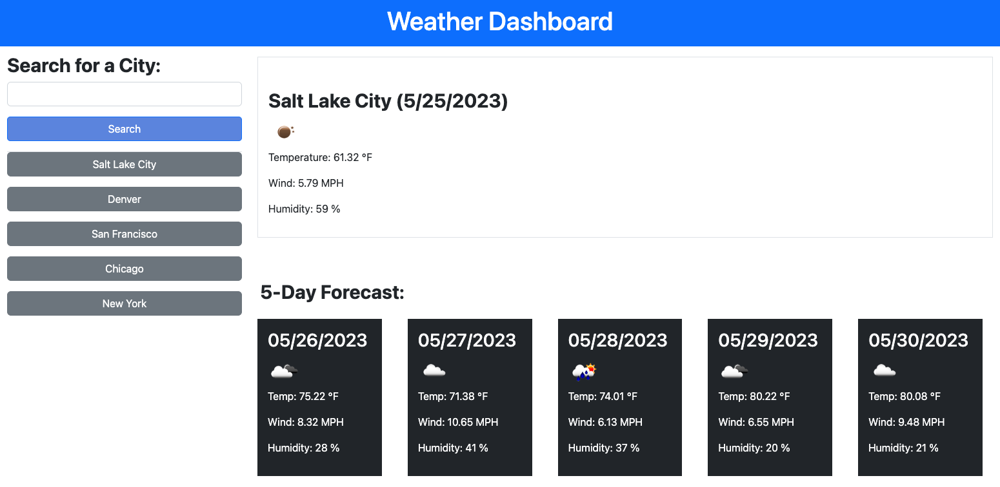

# Weather Dashboard
Module 6 Challenge Server-Side APIs: Weather Dashboard

## Description

This is a weather dashboard built to feature dynamically updated HTML and CSS using the OpenWeatherMap API to retrieve weather data for cities. 

## Usage

Use the form input to search for a city. The current and future 5-day forecast weather conditions for the city searched will be presented on the dashboard. Previously searched cities will be added and displayed to the search history.

The following image demonstrates the application's appearance and functionality:

## Credits

Following libraries were used to create a dynamic weather dashboard:
* jQuery
* moment.js

## Links

* URL to deployed application: https://suzyhan.github.io/weather-dashboard/
* URL of GitHub repository: https://github.com/suzyhan/weather-dashboard

## License

None
